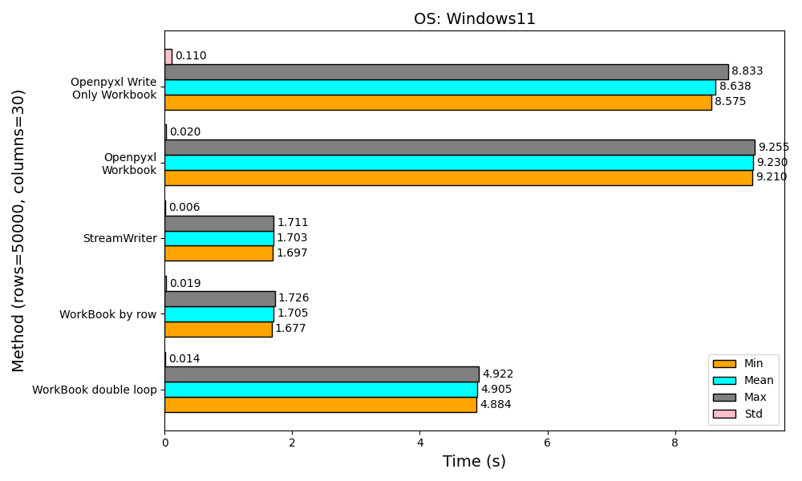

# pyfastexcel


[](https://goreportcard.com/report/github.com/Zncl2222/pyfastexcel)


[](https://app.codacy.com/gh/Zncl2222/pyfastexcel/dashboard?utm_source=gh&utm_medium=referral&utm_content=&utm_campaign=Badge_grade)
[](https://codecov.io/gh/Zncl2222/pyfastexcel)
[](https://pyfastexcel.readthedocs.io/en/stable/?badge=stable)

This package enables high-performance Excel writing by integrating with the
streaming API from the golang package
[excelize](https://github.com/qax-os/excelize). Users can leverage this
functionality without the need to write any Go code, as the entire process
can be accomplished through Python.

## Features

- Python and Golang Integration: Seamlessly call Golang built shared
libraries from Python.

- No Golang Code Required: Users can solely rely on Python for Excel file
generation, eliminating the need for Golang expertise.

## Installation

### Install via pip (Recommended)

You can easily install the package via pip

```bash
pip install pyfastexcel
```

### Install manually

If you prefer to build the package manually, follow these steps:

1. Clone the repository:

    ```bash
    git clone https://github.com/Zncl2222/pyfastexcel.git
    ```

2. Go to the project root directory:

    ```bash
    cd pyfastexcel
    ```

3. Install the required golang packages:

    ```bash
    go mod download
    ```

4. Build the Golang shared library using the Makefile:

    ```bash
    make
    ```

5. Install the required python packages:

    ```bash
    pip install -r requirements.txt
    ```

    or

    ```bash
    pipenv install
    ```

6. Import the project and start using it!

## Requirements

| Operating System | Version                         |
| ---------------- | ------------------------------- |
| **Linux**        | Ubuntu 18.04 or higher          |
| **macOS**        | macOS 13 (x86-64)               |
| **Windows**      | Windows 10 or higher            |


### Python Versions

- **Python 3.8 or higher**

For earlier versions of Python or other operating systems, compatibility is not guaranteed.

## Usage

The index assignment is now avaliable in `Workbook` and the `StreamWriter`.
Here is the example usage:

```python
from pyfastexcel import Workbook
from pyfastexcel.utils import set_custom_style

from pyfastexcel import CustomStyle


if __name__ == '__main__':
    # Workbook
    wb = Workbook()

    # Set and register CustomStyle
    bold_style = CustomStyle(font_size=15, font_bold=True)
    set_custom_style('bold_style', bold_style)

    ws = wb['Sheet1']
    # Write value with default style
    ws['A1'] = 'A1 value'
    # Write value with custom style
    ws['B1'] = ('B1 value', 'bold_style')

    # Write value in slice with default style
    ws['A2': 'C2'] = [1, 2, 3]
    # Write value in slice with custom style
    ws['A3': 'C3'] = [(1, 'bold_style'), (2, 'bold_style'), (3, 'bold_style')]

    # Write value by row with default style (python index 0 is the index 1 in excel)
    ws[3] = [9, 8, 'go']
    # Write value by row with custom style
    ws[4] = [(9, 'bold_style'), (8, 'bold_style'), ('go', 'bold_style')]

    # Send request to golang lib and create excel
    wb.read_lib_and_create_excel()

    # File path to save
    file_path = 'pyexample_workbook.xlsx'
    wb.save(file_path)

```

For row-by-row Excel writing, consider using `StreamWriter`, a
subclass of Workbook. This class is optimized for streaming large datasets.
Learn more in the [StreamWriter](https://pyfastexcel.readthedocs.io/en/stable/writer/) documentation.

Explore additional examples in the [FullExamples](https://github.com/Zncl2222/pyfastexcel/tree/main/examples).

## Documentation

The documentation is hosted on Read the Docs.

- [Development Version](https://pyfastexcel.readthedocs.io/en/latest/)

- [Latest Stable Version](https://pyfastexcel.readthedocs.io/en/stable/)

## Benchmark

The following result displays the performance comparison between
`pyfastexcel` and `openpyxl` for writing 50000 rows with 30
columns (Total 1500000 cells). To see more benchmark results, please
see the [benchmark](https://pyfastexcel.readthedocs.io/en/stable/benchmark/).

<dev align='center'>
    
</dev>

## How it Works

Python keeps the existing workbook and `(value, style_name)` API. With the
bundled ABI-v2 library it sends JSON metadata plus MessagePack row frames over
a length-aware ctypes boundary; Go decodes one row at a time and writes it with
[excelize](https://github.com/qax-os/excelize). Older native libraries are
detected automatically and continue to use the complete JSON/base64 protocol.
The generated XLSX is returned as raw bytes, or written through the compatible
direct-file path when `save(path)` is used.

Row decoding runs concurrently with excelize's row serialization, workbooks
with multiple stream sheets are written with one worker per sheet, and the hot
Python paths (`row_append`, the wire encoder) use cached style resolution with
tight per-row loops. Two opt-in speedups are available on top of that:
`append_row`/`append_rows` write whole rows per call (2-3x faster than a
per-cell loop, styles may vary per column), and
`set_zip_compression_level(6)` swaps the final DEFLATE stage for
[klauspost/compress](https://github.com/klauspost/compress) (about 3x faster
compression for roughly 20% larger, fully standard files). Without opt-ins the
output archives stay byte-for-byte identical to previous releases.
