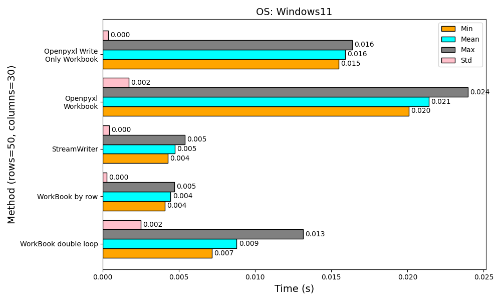
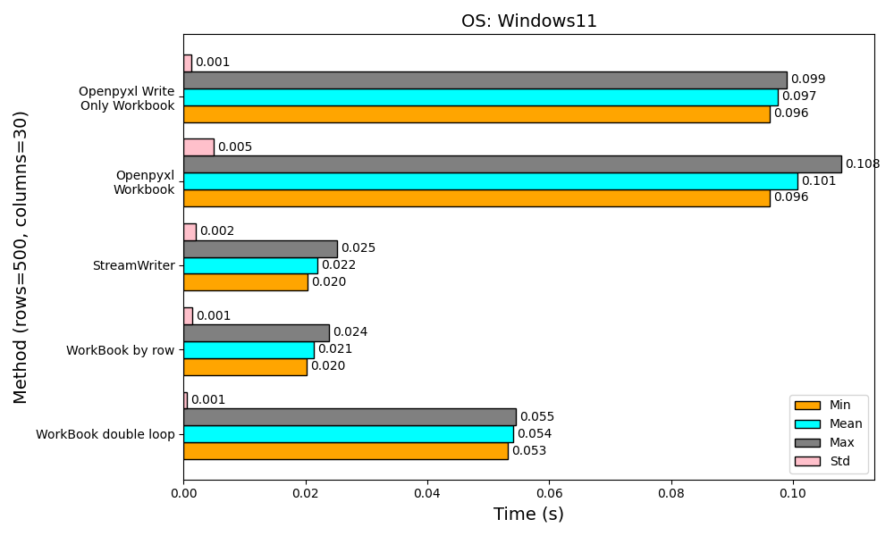
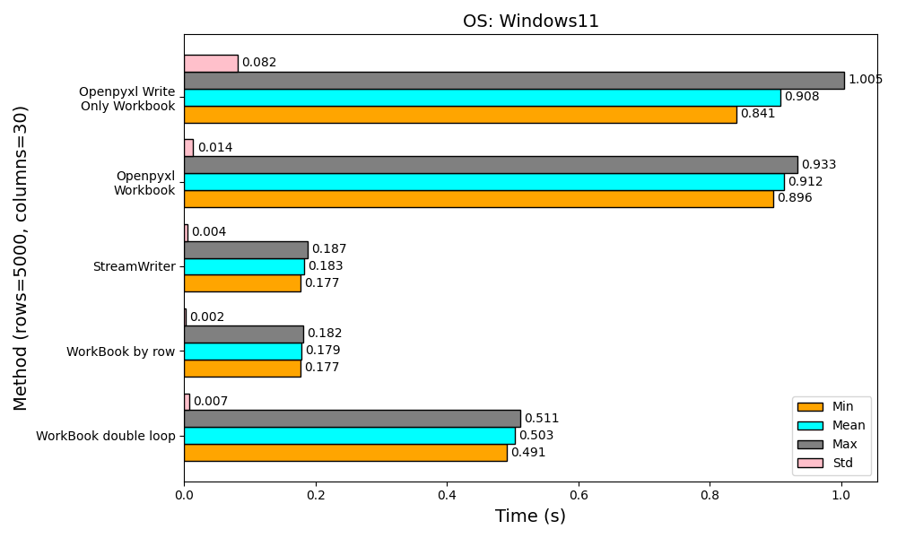
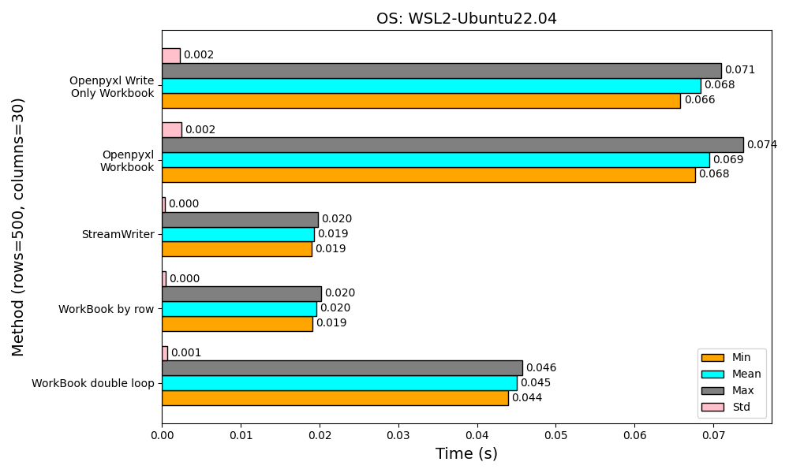
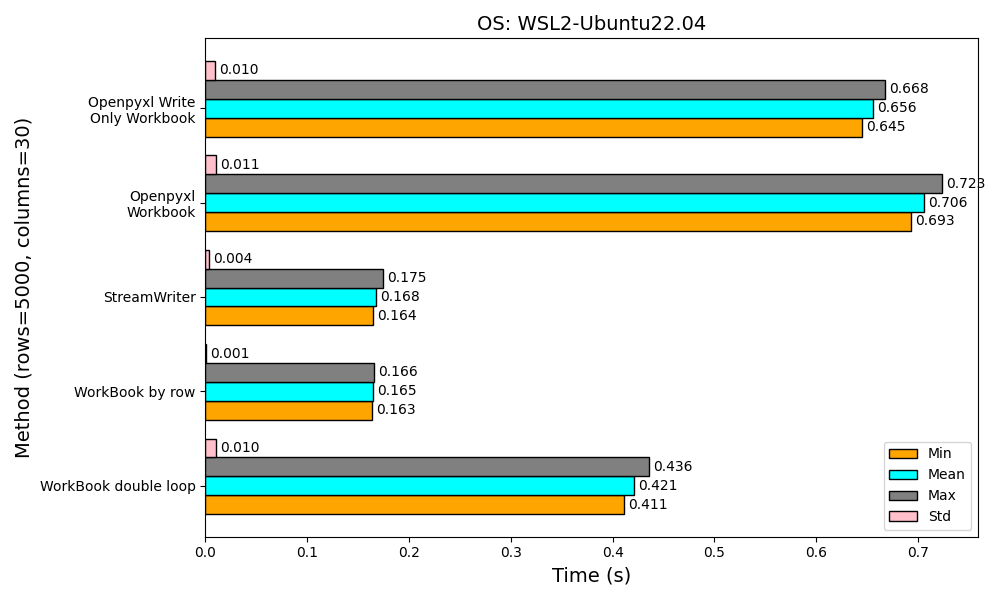
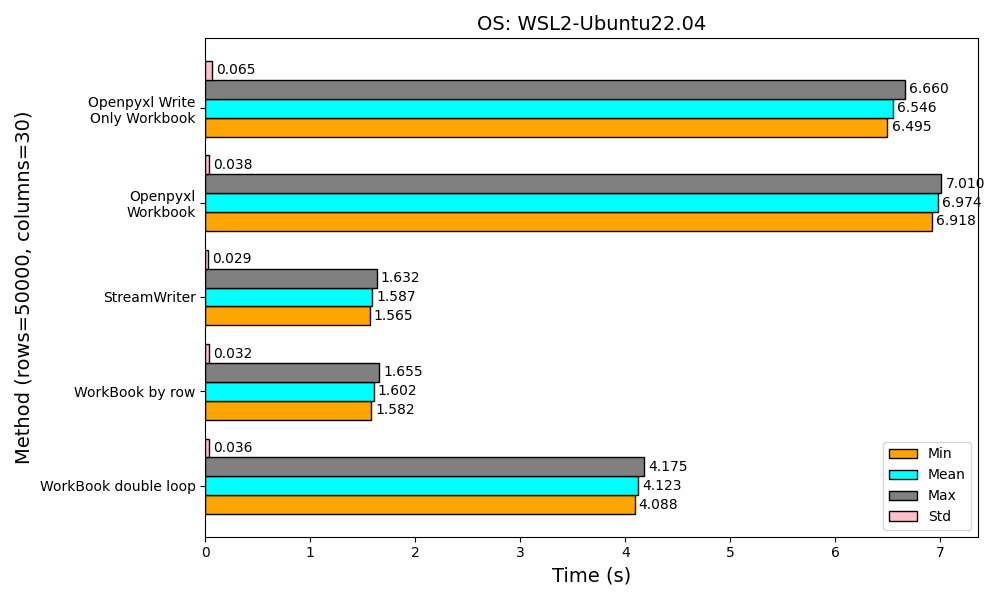

# Benchmark

The following results show the performance comparison between `pyfastexcel` and `openpyxl` when writing a data to an Excel file in different scenario.

- [Windows11](#benchmark-result-windows-11)
- [Windows11 WSL2 Ubuntu22.04](#benchmark-results-windows-11-wsl2-ubuntu-2204)

## Benchmark Environment

> - OS: Windows 11 & Windows 11 WSL2 Ubuntu 22.04
> - CPU: Intel(R) Core(TM) i7-12700 CPU
> - RAM: DDR4-3200 32GB
> - Hard Drive: Crucial P5 Plus 1TB Read: 6,600 MB/s Write: 5,000 MB/s
> - Python: 3.11.0
> - openpyxl: 3.1.2
> - pyfastexcel: 0.8.0

## Benchmark Results (Windows 11)

### Write 50 rows with 30 columns (Total 1500 cells)

<dev align='center'>
    
</dev>

### Write 500 rows with 30 columns (Total 15000 cells)

<dev align='center'>
    
</dev>

### Write 5000 rows with 30 columns (Total 150000 cells)

<dev align='center'>
    
</dev>

### Write 50000 rows with 30 columns (Total 1500000 cells)

<dev align='center'>
    
</dev>

## Benchmark Results (Windows 11 WSL2 Ubuntu 22.04)

### Write 50 rows with 30 columns (Total 1500 cells)

<dev align='center'>
    
</dev>

### Write 500 rows with 30 columns (Total 15000 cells)

<dev align='center'>
    
</dev>

### Write 5000 rows with 30 columns (Total 150000 cells)

<dev align='center'>
    
</dev>

### Write 50000 rows with 30 columns (Total 1500000 cells)

<dev align='center'>
    
</dev>
