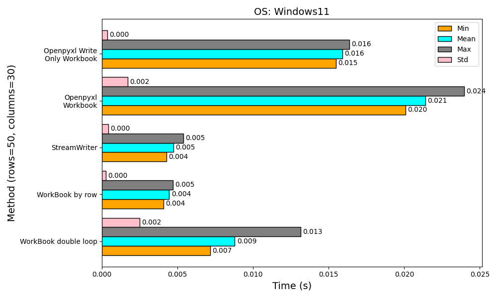
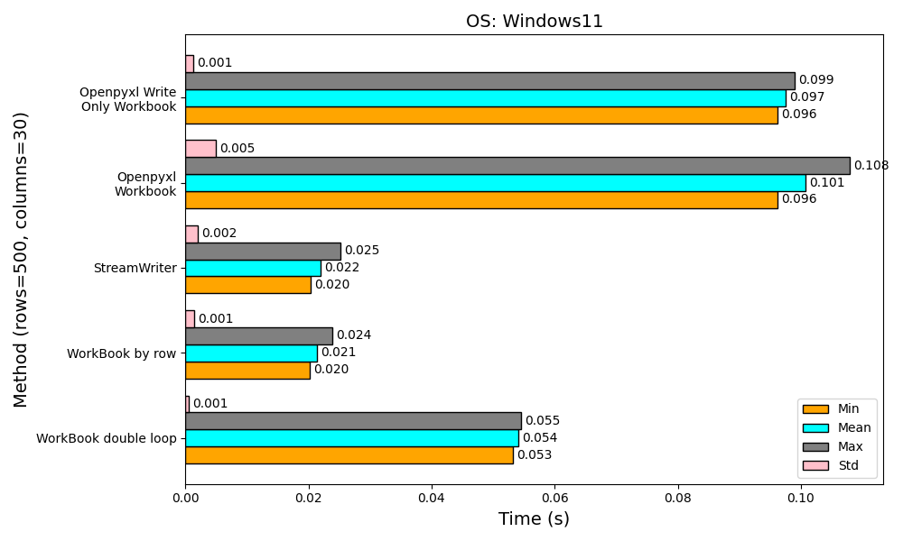
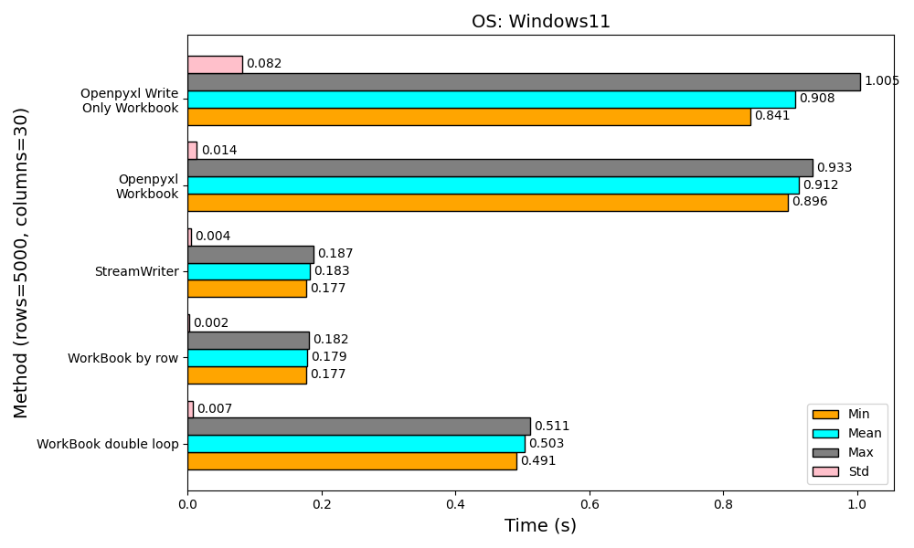
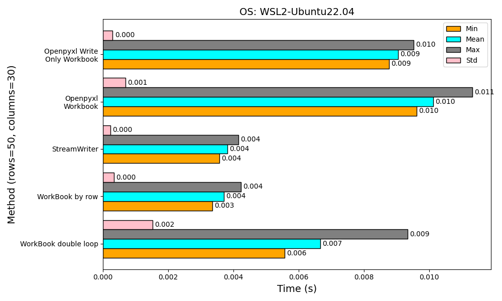
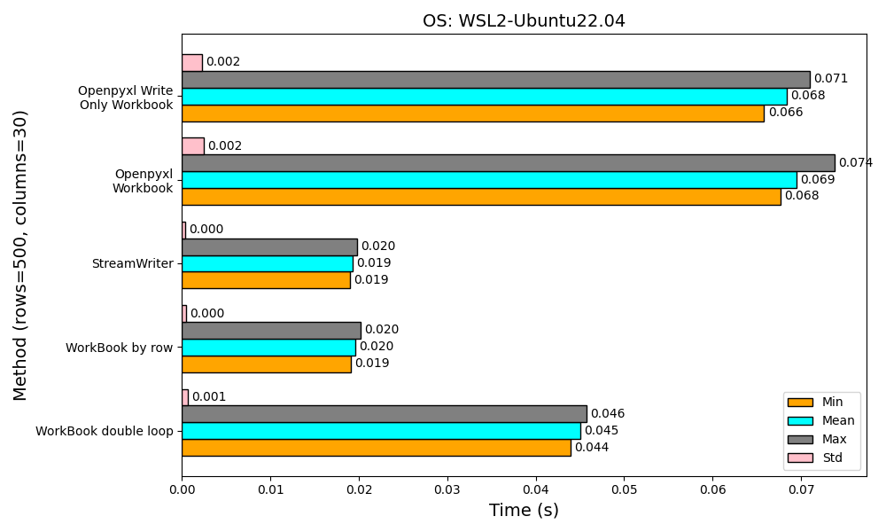
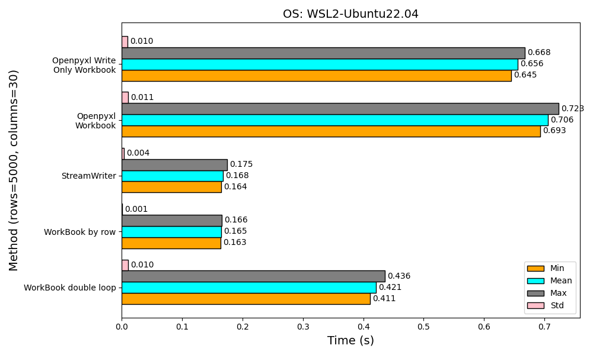
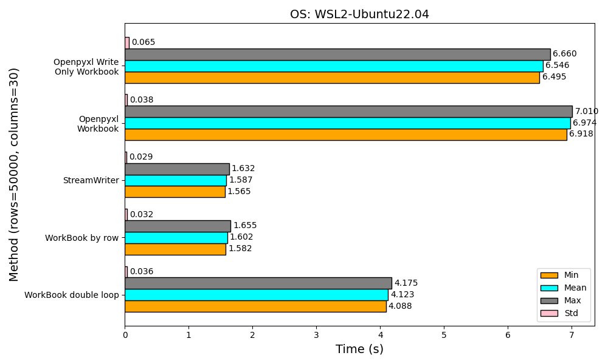

# Benchmark

The following results show the performance comparison between `pyfastexcel` and `openpyxl` when writing a data to an Excel file in different scenario.

## Performance and memory regression benchmark

`perf_memory.py` measures pyfastexcel itself, including workbook construction,
native export, total wall time, and process peak RSS. Every sample runs in a
fresh subprocess so one sample's high-water RSS does not contaminate the next
one. Timing runs never enable `tracemalloc`.

```bash
# Always rebuild first; the harness rejects a stale pre-v2 native library.
make build

# Default MessagePack wire path, 1.5 million styled cells, three samples.
uv run python benchmark/perf_memory.py --rows 50000 --cols 30 --repeat 3 \
  --output optimized.json

# Keep a JSON-wire baseline and compare a later run against it.
uv run python benchmark/perf_memory.py --wire json --output baseline.json
uv run python benchmark/perf_memory.py --compare baseline.json

# Exercise the direct-to-file path (the .bin suffix checks path compatibility).
uv run python benchmark/perf_memory.py --destination file
```

The JSON report records the workload, CPU, Python/Go/dependency versions, git
state, native ABI and shared-library SHA-256, all raw samples, and summary
statistics. Comparisons reject mismatched grid sizes or output destinations.
Use separate runs for time and any allocation profiler; allocation hooks
materially change the Python hot loop.

The Stage A acceptance reports are committed in [`benchmark/results`](results/):
the historical ABI-v1 baseline, ABI-v2 PFX2 result, and ABI-v2 compatibility-JSON
attribution run each contain three fresh-process samples.

The fast-path reports (`2026-07-17-fastpath.json` and
`2026-07-17-fastpath-zip6.json`) measure the tightened Python hot loops, the
Go decode/SetRow pipeline, and the optional `PYFASTEXCEL_ZIP_LEVEL=6`
compressor on the same 1.5M-cell workload. On the reference WSL2 machine they
bring the total from 1.67s to 1.54s (default output, byte-identical archives)
and 1.20s (fast zip, ~20% larger files). Multi-sheet workbooks additionally
write sheets concurrently (sheet_offsets in the wire metadata give each worker
its own row-stream slice): a 4-sheet 1.5M-cell export drops from 0.65s to
0.47s (default) and 0.43s to 0.25s (fast zip). Rerun with:

```bash
uv run python benchmark/perf_memory.py --rows 50000 --cols 30 --repeat 3
PYFASTEXCEL_ZIP_LEVEL=6 uv run python benchmark/perf_memory.py --rows 50000 --cols 30 --repeat 3
```

### End-to-end attribution (2026-07-21)

The `2026-07-21-*` reports re-measure every stage of the rework back to back on
one machine in one sitting, five fresh-process samples each, so the deltas are
free of cross-day drift. The v1 baseline comes from `baseline_probe.py` run in a
worktree at `ab23864` (the commit before the rework); `wire-only` is the
versioned-export pipeline alone, before the fast-path work.

| report | build | export | total | peak RSS |
| --- | --- | --- | --- | --- |
| `2026-07-21-baseline-v1` | 1.363s | 1.321s | 2.684s | 598 MB |
| `2026-07-21-wire-only` | 1.026s | 1.064s | 2.090s (-22%) | 309 MB (-48%) |
| `2026-07-21-fastpath` | 0.893s | 0.850s | 1.743s (-35%) | 311 MB (-48%) |
| `2026-07-21-fastpath-zip6` | 0.827s | 0.592s | 1.420s (-47%) | 315 MB (-47%) |

Two things the split shows: the whole memory win comes from the MessagePack wire
(10.5 MB payload against 29.0 MB of JSON) and nothing after it regresses RSS,
while the fast-path work is what turns a 22% time win into 35%. The default path
still emits a byte-identical 5.58 MB archive; only `PYFASTEXCEL_ZIP_LEVEL=6`
trades size (6.85 MB) for speed. Rendered as
[`2026-07-21-branch-compare.png`](results/2026-07-21-branch-compare.png).

Absolute times here run ~10% above the `2026-07-17-*` reports because the host
was busier; the ratios are what carry across runs.

### Reproducing the pre-rework baseline

`perf_memory.py` cannot run against code from before the perf rework (its wire
module, `NativeExcelClient` and ABI-v2 did not exist yet). `baseline_probe.py`
reproduces the same workload with the *old* public API and emits the same JSON
schema, so a baseline report can be plotted next to current ones. It is meant to
run inside a git worktree checked out at a pre-rework commit; see the module
docstring for the full worktree + `env -u GOROOT make build` recipe. An
independent 2026-07-20 reproduction (baseline v1 vs new v2 json/pfx2/file) is
committed under [`results/reproduction-2026-07-20`](results/reproduction-2026-07-20/).

### Plotting old vs new

`plot_perf.py` reads the committed `perf_memory.py` reports (it never mutates
them, so historical numbers are preserved) and renders a two-panel comparison:
wall time (build / export / total) on the left and peak RSS on the right, with
every non-baseline report annotated by its percentage change against the first.

```bash
# Auto-discover and plot every report in benchmark/results (oldest first).
uv run python benchmark/plot_perf.py

# Pick specific reports and label them; writes to the given PNG.
uv run python benchmark/plot_perf.py \
  results/2026-07-16-stage-a-baseline.json \
  results/2026-07-16-stage-a-pfx2.json \
  --label "v1 baseline" "v2 pfx2" --output results/perf-compare.png
```

### pyfastexcel vs openpyxl throughput

`benchmark.py` runs the Workbook / StreamWriter / openpyxl size matrix and writes
one horizontal-bar PNG per case. Each run also archives a structured result to
`benchmark/results/openpyxl/<date>-<os>-openpyxl.json`, so re-running never
overwrites earlier numbers. The OS label is auto-detected; override it with
`--os-name`.

```bash
uv run python benchmark/benchmark.py                       # auto-detect OS
uv run python benchmark/benchmark.py --os-name Windows11 --repeat 5
```

- [Windows11](#benchmark-result-windows-11)
- [Windows11 WSL2 Ubuntu22.04](#benchmark-results-windows-11-wsl2-ubuntu-2204)

## Benchmark Environment

> - OS: Windows 11 & Windows 11 WSL2 Ubuntu 22.04
> - CPU: Intel(R) Core(TM) i7-12700 CPU
> - RAM: DDR4-3200 32GB
> - Hard Drive: Crucial P5 Plus 1TB Read: 6,600 MB/s Write: 5,000 MB/s
> - Python: 3.11.0
> - openpyxl: 3.1.2
> - pyfastexcel: 0.8.0

## Benchmark Results (Windows 11)

### Write 50 rows with 30 columns (Total 1500 cells)

<dev align='center'>
    
</dev>

### Write 500 rows with 30 columns (Total 15000 cells)

<dev align='center'>
    
</dev>

### Write 5000 rows with 30 columns (Total 150000 cells)

<dev align='center'>
    
</dev>

### Write 50000 rows with 30 columns (Total 1500000 cells)

<dev align='center'>
    
</dev>

## Benchmark Results (Windows 11 WSL2 Ubuntu 22.04)

### Write 50 rows with 30 columns (Total 1500 cells)

<dev align='center'>
    
</dev>

### Write 500 rows with 30 columns (Total 15000 cells)

<dev align='center'>
    
</dev>

### Write 5000 rows with 30 columns (Total 150000 cells)

<dev align='center'>
    
</dev>

### Write 50000 rows with 30 columns (Total 1500000 cells)

<dev align='center'>
    
</dev>
