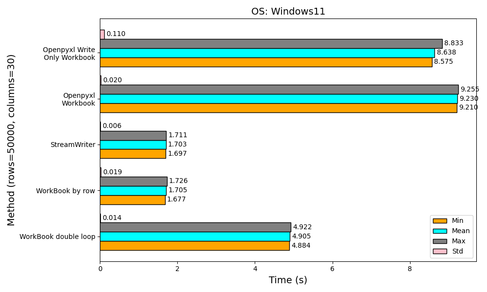

# Introduction


[](https://goreportcard.com/report/github.com/Zncl2222/pyfastexcel)


[](https://app.codacy.com/gh/Zncl2222/pyfastexcel/dashboard?utm_source=gh&utm_medium=referral&utm_content=&utm_campaign=Badge_grade)
[](https://codecov.io/gh/Zncl2222/pyfastexcel)
[](https://pyfastexcel.readthedocs.io/en/stable/?badge=stable)

This package enables high-performance Excel writing by integrating with the
streaming API from the golang package
[excelize](https://github.com/qax-os/excelize). Users can leverage this
functionality without the need to write any Go code, as the entire process
can be accomplished through Python.

## Features

- Python and Golang Integration: Seamlessly call Golang built shared
libraries from Python.

- No Golang Code Required: Users can solely rely on Python for Excel file
generation, eliminating the need for Golang expertise.

## How it Works

The core functionality revolves around encoding Excel cell data and styles,
or any other Excel properties, into a JSON string within Python. This JSON
payload is then passed through ctypes to a Golang shared library. In Golang,
the JSON is parsed, and using the streaming writer of
[excelize](https://github.com/qax-os/excelize) to wrtie excel in
high performance.

## Dependency

The dependency for python and golang

python:

    msgspec (for faster json encoding)
    pydantic v2

golang:

    excelize (Core functionality)
    marshmallow (for faster json decoding)

## Installation

### Install via pip (Recommended)

You can easily install the package via pip

```bash
pip install pyfastexcel
```

### Install manually

If you prefer to build the package manually, follow these steps:

1. Clone the repository:

    ```bash
    git clone https://github.com/Zncl2222/pyfastexcel.git
    ```

2. Go to the project root directory:

    ```bash
    cd pyfastexcel
    ```

3. Install the required golang packages:

    ```bash
    go mod download
    ```

4. Build the Golang shared library using the Makefile:

    ```bash
    make
    ```

5. Install the required python packages:

    ```bash
    pip install -r requirements.txt
    ```

    or

    ```bash
    pipenv install
    ```

6. Import the project and start using it!

## Requirements

| Operating System | Version                         |
| ---------------- | ------------------------------- |
| **Linux**        | Ubuntu 18.04 or higher          |
| **macOS**        | macOS 13 (x86-64)               |
| **Windows**      | Windows 10 or higher            |


### Python Versions

- **Python 3.8 or higher**

For earlier versions of Python or other operating systems, compatibility is not guaranteed.

## Benchmark

The following result displays the performance comparison between
`pyfastexcel` and `openpyxl` for writing 50000 rows with 30
columns (Total 1500000 cells). To see more benchmark results, please
see the [benchmark](https://pyfastexcel.readthedocs.io/en/stable/benchmark/).

<dev align='center'>
    
</dev>
